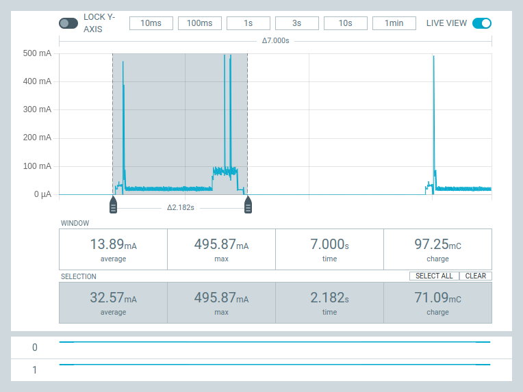

# ESP32 MQTT Gateway

# 1. Introduction

This module provides publish and subscribe MQTT access using ESPNow. Benefits
relative to running an `mqtt_as` client are:
 1. Nodes can be designed to have extremely low power consumption.
 2. Node scripts can comprise a small amount of synchronous code. This is of
 particular benefit on ESP8266.
 3. WiFi and broker outages are handled by the gateway rather than by a large
 library running on the node.

The gateway is an `mqtt_as` client running on ESP32 hardware. A good WiFi
connection provides access to an MQTT broker. One or more nodes running on ESP
hardware use ESPNow to publish and to receive MQTT messages targeted on them.


Nodes may run synchronous or asynchronous code. They can run continuously or
operate in micropower mode where they spend most of the time in deepsleep.
ESPNow enables substantial power saving compared to a normal `mqtt_as` client.
While an `mqtt_as` client can be put into deepsleep between publications,
re-establishing a WiFi connection and re-connecting to the broker takes time
and consumes power. By contrast ESPNow can start very quickly after a wake
from deepsleep and communications can complete quickly.

Continuously running asynchronous nodes can receive subscription messages with
low latency. Clearly this is not the case for micropower nodes which can only
receive messages when they wake: the gateway queues messages for when the node
wakes.

## 1.1 Tradeoffs relative to mqtt_as

There are tradeoffs relative to running an `mqtt_as` client. The ESPNow node
supports only basic publish and subscribe MQTT operations, whereas the
`mqtt_as` client adds broker directives such as last will and clean session.

The `qos==1` guarantee is honoured for publications from the node. Messages to
the node are normally assured of delivery, however while the node is asleep the
gateway buffers messages in a fixed-size queue. If the node does not wake in
time to receive them, the messages will be lost, starting with the oldest.

Handling of broker outages and WiFi channel changes is automatic in an
`mqtt_as` node, and can be automatic in synchronous nodes. Micropower nodes can
be automatic, but extra power saving can be achieved with application support.

On the plus side code is small and can be run on an ESP8266 without special
precautions with over 25K of free RAM. Achieving long term battery opertaion is
easy.

## 1.2 Hardware

The gateway requires an ESP32, preferably a standard ESP32 with or without
SPIRAM. Nodes may be ESP32, ESP8266, or ESP32 variants. Some ESP32-S3 boards
have had issues: see Appendix 2.

## 1.3 MQTT version

Messages between the gateway and the broker conform to MQTT V3.1.1.

# 2. Overview

## 2.1 Micropower publish-only applications

A micropower publish-only application can be simple. The following publishes a
reading once per minute from the ambient light sensor of a
[FeatherS3 board](https://esp32s3.com/):
```python
from machine import deepsleep, ADC, Pin
import time
from .link import Link
gateway = "2462abe6b0b5"  # Identity of gateway
# Case where WiFi AP channel is known
channel = 3  # WiFi AP channel
credentials = None  # Fixed channel
gwlink = Link(gateway, channel, credentials)

adc = ADC(Pin(4), atten = ADC.ATTN_11DB)
msg = str(adc.read_u16())
gwlink.publish("light", msg, False, 0)
gwlink.close()
deepsleep(60_000)  # main.py runs the app again when deepsleep ends.
```
In this example the AP is assumed to run on a fixed channel (3). The gateway
forwards the publication to the broker which may be local or on the internet.

## 2.2 Micropower subscribe-only applications

The following script wakes every 10s, receives any messages published to
"foo_topic" or "allnodes" and re-publishes them to "shed".
```python
from machine import deepsleep, Pin
from .link import Link
gateway = "2462abe6b0b5"  # Identity of gateway
# Case where WiFi AP channel is not known and may vary
channel = None  # Indicate unknown channel
credentials = ("ssid", "password")  # WiFi access
gwlink = Link(gateway, channel, credentials)

def echo(topic, message, retained):
    gwlink.publish("shed", message)

gwlink.subscribe("foo_topic", 1)
gwlink.get(echo)  # Get any pending messages
gwlink.close()
deepsleep(10_000)
# Now effectively does a hard reset: main.py restarts the application.
```
The gateway queues subscriptions, forwarding them to the node when it wakes.
The node receives a JSON encoded 3-list comprising topic name, payload and the
retain flag.

In this example the AP may change channel. Connection to WiFi is used to
associate the node with the current channel. An alternative way to determine
the channel exists: this avoids having to use WiFi credentials and saves
power at the cost of a small amount of additional application code.

# 3. Quick start guide

This requires the following steps. Ensure that all ESP devices to be used have
the latest daily build of firmware.

## 3.1 Access Point setup

The ESPNow protocol requires that the WiFi channel does not change. Some access
points or routers pick a channel on power up or may change channel in response
to varying radio conditions. Ideally the AP should be set to use a fixed
channel. This enables a rapid recovery from an outage and minimises power
consumption of micropower nodes. If a fixed channel is impractical the `Link`
class provides means of adapting to variation.

## 3.2 Gateway installation

On the gateway ESP32 device, connect to WiFi and install with
```python
import mip
mip.install("github:peterhinch/micropython-mqtt/gateway")
```
Alternatively, with no need to connect the target to WiFi:
```bash
$ mpremote mip install github:peterhinch/micropython-mqtt/gateway
```
Edit the file `lib/gateway/mqtt_local.py` on the device to include the correct
WiFi credentials and broker IP address. This file is as follows:
```python
from .mqtt_as import config

# Entries must be edited for local conditions
config["server"] = "192.168.0.10"  # Broker
#  config["server"] = "test.mosquitto.org"

config["ssid"] = "your_network_name"
config["wifi_pw"] = "your_password"
```
## 3.3 Gateway test

The following tests verify communication between the gateway and the broker.
Assuming that the broker is on 192.168.0.10, open a terminal and issue
```bash
$ mosquitto_sub -h 192.168.0.10 -t gw_status
```
Start the gateway by issuing the import at the device REPL - output similar to
the following should ensue:
```python
>>> import gateway
ESPNow ID: b"70041dad8f15"
Checking WiFi integrity.
Got reliable connection
Connecting to broker.
Connected to broker.
Gateway b'70041dad8f15' connected to broker 192.168.0.10.
```
The terminal running `mosquitto_sub` should show
```bash
12/7/2023 16:52:13 Gateway b'70041dad8f15' connected to broker 192.168.0.10.
```
Keep a record of the gateway ID (`b'70041dad8f15'` in the above example). This
is its MAC address in hex format and is required by the nodes.

## 3.4 Synchronous node installation and setup

On the node device, connect to WiFi and install with
```python
import mip
mip.install("github:peterhinch/micropython-mqtt/gateway/nodes")
```
Or, on the PC run
```bash
$ mpremote mip install github:peterhinch/micropython-mqtt/gateway/nodes
```
Configuration may be done by editing the file `lib/nodes/link_setup.py`. This
creates the following variables which are the constructor arguments for the
`Link` class. Using a file simplifies distributing common args to multiple
nodes:
 1. `gateway` MAC address of the gateway as a 12 character string.
 2. `debug` `True` to output debug messages.
 3. `channel` Set to channel number if fixed, else `None`.
 4. `credentials` Set to `None` if channel is fixed else `('ssid', 'password')`.

See [# 5. The Link class](./README.md#5-the-link-class) for full details.

The following demos will be installed on the node:
 1. `synctx.py` General demo of publication and subscription.
 2. `pubonly.py` Micropower publish-only demo.
 3. `pubonly_gen.py` Micropower publish-only demo. Shows an efficient means of
 handling channel changes.
 4. `slow_echo.py` Micropower demo which wakes periodically, re-publishing any
 messages occurring during its sleep.

## 3.5 Synchronous Node Testing

With the gateway running issue `import nodes.synctx`. The following is typical
output, with the response to two publications from `mosquitto_pub`:
```python
>>> import nodes.synctx
Link init.
reconnect chan 3 creds None
connected on channel 3
Actual channel 3
Got subscription   topic: "allnodes" message: "hello there pete" retained False
Got subscription   topic: "foo_topic" message: "hello" retained False
```
It should report publications at three second intervals. On a PC run the
following (changing the IP address to that of the broker). Note the expected
output:
```bash
$ mosquitto_sub -h 192.168.0.10 -t shed
Count 0 ESPNow fails 0 Broker fails 0 mem_free 8182272
Count 1 ESPNow fails 0 Broker fails 0 mem_free 8182160
Count 2 ESPNow fails 0 Broker fails 0 mem_free 8182160
Count 3 ESPNow fails 0 Broker fails 0 mem_free 8182160
Count 4 ESPNow fails 0 Broker fails 0 mem_free 8182160
Count 5 ESPNow fails 0 Broker fails 0 mem_free 8182160
```
To publish to the device run this, changing the IP address to match the broker:
```bash
$ mosquitto_pub -h 192.168.0.10 -t allnodes -m "hello" -q 1
```
The `allnodes` topic publishes to all connected nodes.

## 3.6 Asynchronous node installation and setup

Asynchronous applications are assumed to be continuously running: there is no
micropower support. On the node device, connect to WiFi and install with:
```python
import mip
mip.install("github:peterhinch/micropython-mqtt/gateway/anodes")
```
Or, on the PC run
```bash
$ mpremote mip install github:peterhinch/micropython-mqtt/gateway/anodes
```
Node configuration is done by editing the file `lib/anodes/link_setup.py`. This
is as per synchronous mode, but adds one variable:
 * `poll_interval = 1000`

The asynchronous link polls the gateway periodically, prompting it to send any
pending messages. This defines the interval (in ms) and determines the latency
of incoming messages.

The following demo will be installed on the node:
 1. `asynctx.py` General demo of publication and subscription. Assumes a
 FeatherS3 board.

## 3.7 Asynchronous Node Testing

With the gateway running issue `import anodes.asynctx`. The following is typical
output, with the response to two publications using mosquitto_pub (see below):
```python
>>> import anodes.asynctx
Link init.
reconnect chan 3 creds None
connected on channel 3
Waiting for down
Got subscription   topic: "foo_topic" message: "hello" retained False
Got subscription   topic: "allnodes" message: "hello there pete" retained False
```
It should report publications at three second intervals. On a PC run the
following (changing the IP address to that of the broker). Note the expected
output:
```bash
$ mosquitto_sub -h 192.168.0.10 -t shed
Count 0 Response fails 0 mem_free 8176656
Count 1 Response fails 0 mem_free 8175200
Count 2 Response fails 0 mem_free 8175088
Count 3 Response fails 0 mem_free 8175088
Count 4 Response fails 0 mem_free 8175168
```
To publish to the device run this, changing the IP address:
```bash
$ mosquitto_pub -h 192.168.0.10 -t allnodes -m "hello" -q 1
```
# 5. The Link class

This supports synchronous code including micropower applications.

Constructor args. These are normally defined in `link_setup.py` to enable the
setup of mutiple nodes with common values.
 1. `gateway:str` 12 character gateway ID e.g. "2462abe6b0b5".
 2. `channel` Channel no. if known, else `None`
 3. `credentials` `('ssid', 'password')` else `None`. See
 [section 5.1](./README.md#51-connection-algorithms).
 4. `debug=True`

 The constructor raises an `OSError` if credentials are passed and it fails to
connect to WiFi.

Public methods:
 1. `publish(topic:str, msg:str, retain:bool=False, qos:int=0)` See
 [below](./README.md#52-publish-and-ping-return-values) for return values.
 2. `subscribe(topic:str, qos:int)` Returns `True` unless ESPNow cannot connect
 to the gateway.
 3. `get(callback)` Receive any pending messages. The callback will be run for
 each message. It takes args `topic:str, message:str, retained:bool`. The `get`
 method returns `True` on success, `False` on communications failure.
 4. `ping()` Check the gateway status. Return values are as per `publish` -
 see [below](./README.md#52-publish-and-ping-return-values).
 5. `close()` This should be run prior to `deepsleep` or application quit.
 6. `breakout(Pin)` This is a convenience function for micropower applications.
 It can be hard to get back to a REPL when `main.py` immediately restarts an
 application. Initialising `breakout` with a `Pin` instance defined with
 `Pin.PULL_UP` allows the REPL to be regained: the pin should be linked to gnd
 and the node should be reset.
 7. `get_channel()` Query the gateway's current channel. Returns an `int` or
 `None` on fail.
 8. `reconnect()` Force a reconnection. Returns the channel number. It is not
 normally needed: micropower applications instantiate a `Link` each time they
 run while continuously running applications handle outages and channel changes
 automatically.

Public bound variable:
 1. `txpower=None`. Certain ESP32-S3 boards are unreliable when running at
 low channel numbers. The default sets transmit power to maximum: on these
 boards a value of 17 improves reliability. The value should be set before
 instantiating. See appendix 2.

## 5.1 Connection algorithms

The method of connection and of responding to AP channel changes depends on the
`channel` and `credentials` constructor args.
 1. Channel is fixed. This is the simplest case with lowest power consumption.
 It is addressed by setting the `channel` arg and setting `credentials=None`.
 2. Acquire the channel using WiFi, achieved by setting `channel=None` and
 providing SSID and password in `credentials`. Channel changes are tracked
 automatically. Some duplicate publications may occur while the channel change
 is being detected. Initial connection on power up is slow (a few seconds); in
 micropower applications this equates to energy used.
 3. Acquire the channel by querying the gateway, achieved with `channel=None`
 and `credentials=None`. In a variable channel environment this offers lower
 power consumption. To minimise power the application can be designed to manage
 connection. The `pubonly_gen.py` demo illustrates this. The channel is stored
 in nonvolatile RAM along with an error count. Normally the `Link` is
 instantiated with the stored channel, which is fast. If consecutive errors
 exceed a threshold, the `Link` is instantiated with `channel=None` prompting a
 gateway query.

## 5.2 Publish and ping return values

The `publish` method returns the following values, defined as constants in
`link.py`.
 1. `PUB_OK` Success.
 2. `BROKER_OUT` Broker is down. Messages have not been lost but gateway queue
 is half full. The application should delay sending more until a `ping` has
 succeeded.
 3. `ESP_FAIL` ESPNow communications are down. Message was not sent.
 4. `PUB_FAIL` Gateway queue is full, message was lost (publish only).

# 6. Class ALink

This supports asynchronous applications, which are assumed to be continuously
running.

Constructor args. These are normally defined in `link_setup.py` to enable the
setup of mutiple nodes with common values.
 1. `gateway` 12 character string representing gateway ID e.g. '2462abe6b0b5'.
 2. `channel` Channel no. if known, else `None`
 3. `credentials` `('ssid', 'password')` if `channel == None` else `None`
 4. `debug=True`
 5. `poll_interval` Determines the period in ms between gateway polling
 messages. A short interval reduces incoming message latency at the cost of
 increasing the load on the gateway.

Public asynchronous methods:
 1. `run()` This should be run on application start. Raises `OSError` if
 credentials are passed and it cannot connect to WiFi.
 2. `publish(topic:str, msg:str, retain:bool=False, qos:int=0)` This will block
 in the absence of ESPNow and broker connectivity.
 3. `subscribe(topic:str, qos:int)`
 4. `reconnect()` Forces a reconnection. Should not be required.

Public synchronous method:
 1. `close()` This should be run prior to application quit.

Public `Event` instances:
 1. `broker_up` Set when gateway has connected to the broker.
 2. `broker_down` Set when gateway has lost connectivity with broker.
 3. `esp_up` Set when an ESPNow message is successfully sent to the gateway.
 4. `esp_down` Set when an ESPNow message has failed.

An application using any of these events should clear them.

Public bound variable:
 1. `txpower = None`. Certain ESP32-S3 boards are unreliable when running at
 low channel numbers. The default sets transmit power to maximum: on these
 boards a value of 17 improves reliability. The value should be set before
 instantiating. See appendix 2.

Message retrieval:  
An `ALink` instance is an asynchronous iterator. Messages are retrieved with
`async for` as per this example:
```python
async def do_subs(lk):  # lk is an ALink instance
    await lk.subscribe("foo_topic", 1)
    async for topic, message, retained in lk:
        print(f'Got subscription   topic: "{topic}" message: "{message}" retained {retained}')
```

# 7. Publication to all nodes

There is a topic `"allnodes"`: if an external device publishes to this topic,
the gateway will forward it to all nodes. The name of this topic may be changed
in the gateway configuration file.

# 8. The gateway

The following is reference information. The writer of node applications may
only need to be familiar with the gateway configuration. Subsequent paras
describe the internal operation of the gateway.

## 8.1 Gateway configuration

The file `gwconfig.py` instantiates a `defaultdict` with entries defining the
mode of operation of the gateway. These have default values so the file may not
need to be edited for initial testing. Keys and defaults are as follows:
```python
PubIn = namedtuple("PubIn", "topic qos")  # Publication to gateway/nodes from outside
PubOut = namedtuple("PubOut", "topic retain qos")  # Publication by gateway

gwcfg = defaultdict(lambda : None)
gwcfg["debug"] = True  # Print debug info. Also causes more status messages to be published.
gwcfg["qlen"] = 10  # No. of messages to queue (for each node).
# If queue overruns (e.g. because node is asleep), oldest messages will be lost.
gwcfg["lpmode"] = True  # Set True if all nodes are micropower: messages are queued
# and only forwarded to the node after it has published.
# If False the gateway will attempt to send the message on receipt, only queuing
# it on failure.
gwcfg["use_ap_if"] = True  # Enable ESP8266 nodes by using AP interface. This has
# the drawback of advertising an AP. If all nodes are ESP32 this may be set False
# enebling station mode to be used. Note that this affects the gateway ID.
gwcfg["pub_all"] = PubIn("allnodes", 1)  # Publish to all nodes with qos==1

# Optional keys
gwcfg["errors"] = PubOut("gw_errors", False, 1)  # Gateway publishes any errors.
gwcfg["status"] = PubOut("gw_status", False, 0)  # Destination for status reports.
gwcfg["statreq"] = PubIn("gw_query", 0)  # Status request (not yet implemented)
# gwcfg["ntp_host"] = "192.168.0.10"  # Override internet timeserver with local
gwcfg["ntp_offset"] = 1  # Local time = utc + offset
```
`PubIn` objects refer to topics to which the gateway (rather than a node) will
respond. `PubOut` topics are those to which the gateway may publish. If an
error occurs the gateway will publish it to the topic with key `"errors"`. If
"debug" is `True` the gateway will also print it.

Gateway publications may be prevented by omitting the relevant `PubOut` key.

Gateway error and status reports have a timestamp. The module will attempt to
set the ESP32 RTC from an NTP timeserver. If the NTP daemon is run on a local
host the host's IP may be specified. Alternatively time setting may be disabled
by setting `gwcfg["ntp_host"] = False`.

## 8.2 General operation

The gateway has a bound `mqtt_as` client instance (`.client`) and a dictionary
of nodes (`.queues`). The dict keys are gateway MAC addresses. Each node has
a queue for subscription messages from the client. In general messages cannot
be delivered immediately because the node my be asleep. When a node first sends
a message to the gateway a new `queues` key  is created and a queue assigned.

Messages from node to gateway are JSON-encoded lists whose length defines the
type of message. A single element list is a command, two elements denotes a
subscription and four a publication. Other lengths are ignored and an error
message published to the gateway error topic.

In the event of a broker outage, the client's publish method will block. The
gateway sends an `"ACK"` message to the node when publication is complete. This
enables the link to provide feedback to the application preventing message
loss.

If the link requests messages or queries status (via `.ping`), the gateway
responds with `"UP"` or `"DOWN"`.

## 8.3 Publications from a node

Each node sends the gateway a message comprising a json-encoded 4-list.
Elements are:
 1. `topic:str`
 2. `message:str`
 3. `retain:bool`
 4. `qos:int`

These are as per `mqtt_as` documentation with the exception that bit 2 of `qos`
may be set: in this case the gateway will respond with an acknowledge. This
enables the design of nodes which re-transmit lost ESPNow messages. The
acknowledge takes the form of a subscribed message having topic and message
fields being `"ACK"` (see below).

## 8.4 Publications to a node

A device sends a message to a node by publishing a specially formatted message.
The topic must be one to which the gateway has subscribed. The gateway
subscribes to a default topic defined as a tuple in the file `mqtt_local.py`. A
topic is defined as a 2-tuple with the following elements:
 1. `topic_name:str`
 2. `qos:int` This is the qos to use in communication with the broker. The
 default is the topic "gateway" with qos of 1. It is defined as follows in
 `mqtt_local.py`:
```python
config["gwtopic"] = ("gateway", 1)
```
A typical publication looks like
```bash
$ mosquitto_pub -h 192.168.0.10 -t allnodes -m "hello" -q 1
```
Where `192.168.0.10` is the IP address of the broker, `allnodes` is the gateway
topic, and `"hello"` is the MQTT message. The message can optionally be a JSON
encoded object.

### 8.4.2 Node setup

All nodes are set up to receive ESPNow messages via `link_setup.py`. When a
device publishes to a topic to which a node is subscribed, the gateway forwards
an ESPNow message to the node. All nodes are subscribed to the default topic.

A normal message is a JSON-encoded 3-list comprising:
 1. `topic:str`
 2. `message:str` This may itself be JSON-encoded for complex objects.
 3. `retained:bool`
`"OUT"` and `"ACK"` messages are 2-lists lacking the `retained` element.

## 8.5 Broker/WiFi outages

A node tests status by sending a `ping` message or attempting to retrieve
messages from the gateway, which responds by sending a special `"UP"` or
`"DOWN"` message to the node depending on the state of the `mqtt_as` client.
If publication is attempted during an outage the gateway responds with `"NAK"`.
The gateway will continue trying until the outage ends, when it sends `"ACK"`.

In the event of a `"NAK"` the behaviour of the link depends on whether the
synchronous or asynchronous version is running. The asynchronous `publish`
pauses until publication is complete. The synchronous version returns `False`.
The synchronous application can keep trying to send the next message until a
`True` value occurs.

The gateway will publish status messages indicating connection state.

## 8.6 Publication to all nodes

This is done by publishing to the default topic as defined in `gwconfig.py`.
The message will be forwarded to all nodes which have communicated with the
gateway. With the default topic "allnodes":
```bash
$ mosquitto_pub -h 192.168.0.10 -t allnodes -m "hello" -q 1
```
## 8.7 Subscriptions

When a node subscribes to a topic, the gateway responds as follows. If another
node has already subscribed to this topic, the node will be added to the set of
subscribed nodes. If no other node has subscribed to this topic, the gateway
will cause the `mqtt_as` client to subscribe to the broker and will create a
record identifying the topic and the node. This ensures that future messages
are routed to that node.

## 8.8 Message integrity

Radio communications suffer from three potential issues:
 1. Corrupted messages.
 2. Duplicate messages.
 3. Missing messages.

In ESPNow Corrupted messages never seem to occur. The TCP/IP protocol ensures
they are not a problem for `mqtt_as`.

Dupes can occur for various reasons, including the limitations of MQTT qos==1.
ESPNow transmission uses a handshake to verify successful transmission. This
can be pessimistic, reporting failure when success has occurred. In this
situation the gateway will re-transmit, causing a dupe. There is also the issue
of broadcast messages to clients that are awake, as discussed above. If dupes
are an issue a message ID should be used to enable the application to discard
them.

At MQTT level missing messages should never occur if qos==1 is used. ESPNow has
a handshake which, in conjunction with the gateway design, should avoid missing
messages from the node. For cast-iron certainty, node publications can request
an acknowledge enabling the application to retransmit. Incoming node messages
have no such mechanism and rely on the ESPNow handshake. I haven't yet
established if the handshake can be considered "perfect" in preventing missed
messages.

# 9. Node application design

## 9.1 Micropower Nodes

In general a node is designed to start, publish, optionally handle subscription
messages, deepsleep for a period, and quit. The `main.py` script restarts it;
consequently no state is retained between runs. To minimise power consumption
code should run as quickly as possible: if possible looping constructs should
be avoided. Code is typically synchronous: `uasyncio` has no support for sleep.

Messages received by the gateway and targeted on a node are queued. They are
forwarded when the node wakes up and issues `gwlink.get()`. Any messages sent
since the last wakeup will rapidly be received in the order in which they were
created. If more messages were sent than can fit in the gateway's queue, the
oldest messages will be lost.

When debugging an application it is often best to start out with `time.sleep()`
calls as this keeps the USB interface active. When the basic design is proven,
`sleep` may be replaced with `deepsleep`. Applications which deepsleep may be
debugged using a UART and an FTDI adapter.

An example of a micropower publish-only application is `pubonly.py` and is
listed in [section 2.1](./GATEWAY.md#21-micropower-publish-only-applications).
A micropower application handling subscriptions is `slow_echo.py`, listed
below:
```python
from machine import deepsleep
from time import sleep_ms
from .link import Link
from .link_setup import gateway, channel, credentials  # Args common to all nodes
try:
    gwlink = Link(gateway, channel, credentials)
except OSError:
    deepsleep(3_000)  # Failed to connect. Out of range?

def echo(topic, message, retained):
    gwlink.publish("shed", message)

gwlink.subscribe("foo_topic", 1)
gwlink.get(echo)  # Get any pending messages
gwlink.close()
deepsleep(3_000)
# Now effectively does a hard reset: main.py restarts the application.
```
This echoes any received message to the `"shed"` topic. Messages may be sent
by publishing to "foo_topic" or to "allnodes":
```bash
mosquitto_pub -h 192.168.0.10 -t allnodes -m "test message" -q 1
```

## 9.2 Continuous running - synchronous

If power consumption is not a concern a node may be kept running continuously.
If the AP is able to change the channel, communications will fail briefly
before recovering. If a node publishes regularly and checks for success there
is a likelihood of duplicate publications. This occurs because, when using an
incorrect channel, ESPNow reports failure when the message has been
successfully sent. The fail status from `link.publish` causes the application
to repeat the publication.

Connectivity outages can occur, for example by a node moving out of range.
These may be detected by checking the return value of `link.publish()` or by
periodically issuing `link.ping()`.

## 9.3 Continuous running - asynchronous

Asynchronous applications are assumed to be continuously running because
asyncio has no `deepsleep` compatibility. Where the AP may change channels the
preferred solution is, in `link_setup.py`, to set `channel=None` and to
populate the `credentials` tuple. Channel changes are then tracked
automatically.

# 10. MQTT - the finer points

The gateway communicates with the broker via an `mqtt_as` client. This supports
the last will and clean session mechanisms which are instructions to the broker
on how to behave in response to client outages. To enable the broker to detect
outages the client sends messages to the broker at regular intervals.

The broker has no concept of nodes attached to a client. Thus a `will` entry in
the `config` dictionary applies to the gateway, not to any of its nodes. Adding
node level mechanisms would require the gateway to act as a mini-broker. It
would complicate node scripts and would conflict with micropower operation (by
requiring regular ping messages). It would also require node scripts to be
asynchronous.

I have no plan to implement these.

When a node publishes a message the `retain` flag works normally: the broker
retains the message for future subscribers if `qos==1`. See the MQTT spec. For
publications to a node, `retain` does not work as it applies to the gateway
rather than to the node. The gateway assumes that an absent node is asleep. All
messages destined to it are queued and will be forwarded to the node when it
wakes.

# Appendix 1 Power saving

Where a target has limited power available there are measures which can be
taken to reduce the energy consumed each time it wakes from deepsleep.

In my testing any gains from precompiling to `.mpy` files are too small to
measure. The [connection algorithms](./README.md#51-connection-algorithms) were
tested by running the `pubonly` demo on an ESP32_S3 with the following results:

| Algorithm     | Time (s) | Charge (mC) |
|:--------------|:---------|:------------|
| Fixed         | 1.8      | 112         |
| Query (ch 12) | 2.2      | 153         |
| WiFi          | 4.2      | 300         |

To get a figure for battery consumption, consider a node with deepsleep current
of 50μA publishing once per hour where the channel is fixed. There are ~8760
hours in a year. A mC is a mA for 1s, hence 1/3600 of a mAH. Consumption in mAH
over a year is thus:
```
8760*(50/1000 + 112/3600) = 710mAH
```
See [this repo](https://github.com/glenn20/upy-esp32-experiments) from @glenn20
for a much more detailed exposition including ways to radically reduce energy
used on boot.

For comparison I tested an ESP8266 Feather Huzzah: this board is suited for
micropower use as it lacks a USB chip. Running the same demo on a fixed channel
it used 71mC over 2s. Deepsleep current was 102μA. One year power was therefore:
```
8760*(102/1000 + 71/3600) = 1066mAH
```
The following images show the current profile for the three mens of channel
definition. Fixed channel:  
  

Seek to channel 3:  
  

WiFi connect:  
  

WiFi connect takes a high current for 4s.

# Appendix 2 The ESP32-S3

This chip can suffer from erratic ESPNow behaviour owing to interference
between the transmitter and the on-chip USB interface. This can be worked round
by using high channel numbers and reduced transmit power. See
[this message](https://github.com/orgs/micropython/discussions/12017#discussioncomment-6465361)
from a hardware manufacturer. Later releases of this particular board have
addressed this issue.
