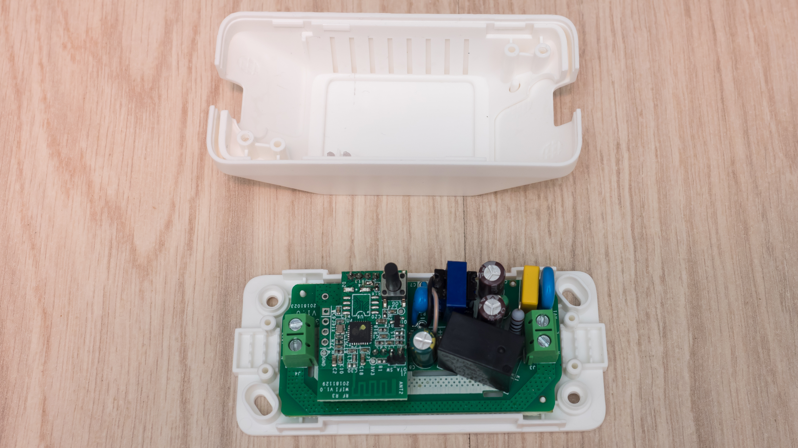
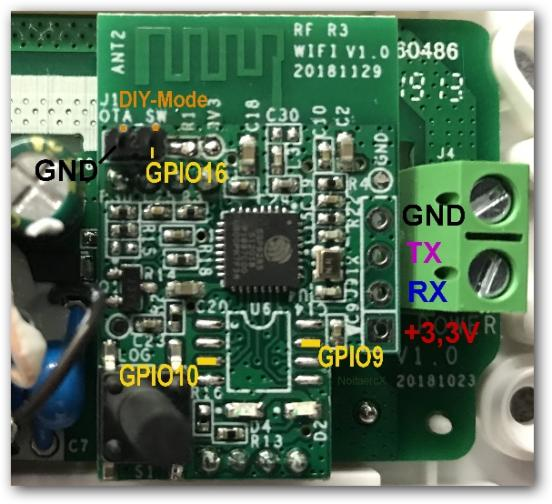

# Hacking the Sonoff Basic R3

The [Sonoff Basic R3](https://sonoff.ie/sonoff/98-sonoff-basic.html) is a WiFi
controlled in-line mains switch. It uses an ESP8285 chip with 1MiB of Flash,
sufficient for a regular ESP8266 MicroPython build with frozen modules plus
space for a small filesystem.


Words of warning:  
 1. Don't attempt this unless you are qualified to work with mains equipment.
 2. Ensure you have the R3 version. R1 and R2 units have an entirely different
 electrical layout. Further, they really don't work very well.

All development should be done with the mains supply disconnected. The
electronics requires 3.3V which may be supplied by an FTDI adaptor.



# Electrical Connections

Use an FTDI adaptor to supply 3.3V and a serial interface. I recommend
[the Adafruit FTDI friend](https://www.adafruit.com/product/284) configured for
3.3V power and logic levels.

Solder a 4-pin header to the WiFi mezannine board. This must be done from above
to avoid having to desolder the WiFi board. I used a male header with the
plastic strip in place (to keep the pins aligned) then cut the pins below the
plastic. You can then plug a female header in to the protruding pins.



Make up a cable with male and female headers to link the FTDI Friend to the
WiFi board.

|     | FTDI (M) | WiFi (F) |     |
|:---:|:--------:|:--------:|:---:|
| Gnd |    1     |     4    | Gnd |
| 3V3 |    3     |     1    | 3V3 |
| Txd |    4     |     2    | Rxd |
| Rxd |    5     |     3    | Txd |

# Installing MicroPython

Build the firmware as per ESP8266.

Put the board into DFU mode by connecting the FTDI cable while pressing the
button on the unit. Change to the build directory (currently
`ports/esp8266/build-GENERIC`) and issue

```
esptool.py --port /dev/ttyUSB0 --baud 115200 write_flash --verify --flash_size=detect -fm dout 0 firmware-combined.bin
```
When this is complete, power cycle the board and verify that you can get a REPL
via the USB interface.

# I/O Map

| GPIO | I/O | Active | Pullup | Signal |
|:----:|:---:|:------:|:------:|:------:|
|   0  |  I  |   L    |   Y    | Pushbutton |
|  12  |  O  |   H    |   N/A  | Relay and red LED |
|  13  |  O  |   L    |   N/A  | Blue LED |
|  16  |  X  |   X    |   Y    | User |

GPIO 16 may be configured as an input or output.

According to the picture above GPIO 9 and 10 are also accessible. I haven't
tested this.

# Test results

I tested using asynchronous MQTT, running `range_ex.py` in various locations.
While I haven't yet done a long running test, initial results are positive with
RSSI values comparable to the ESP8266 reference board.
